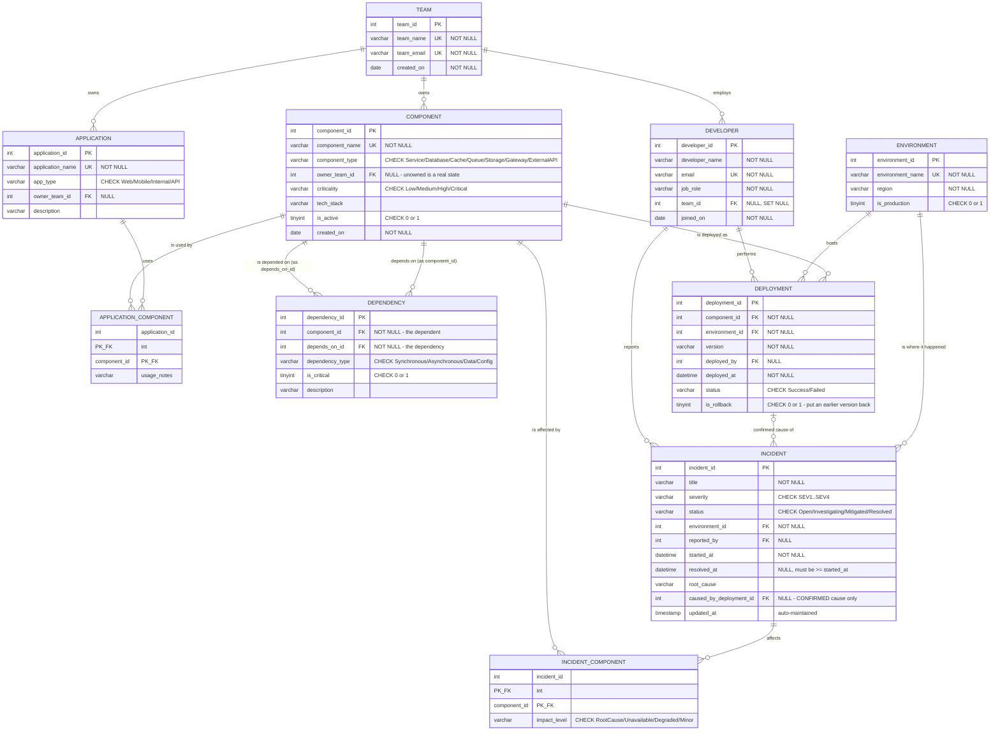
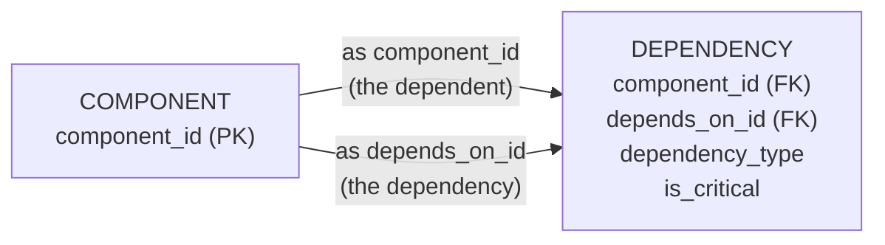
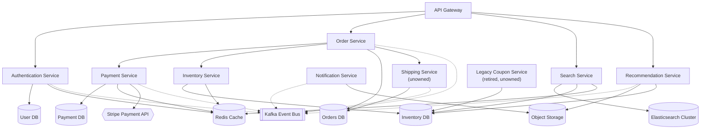
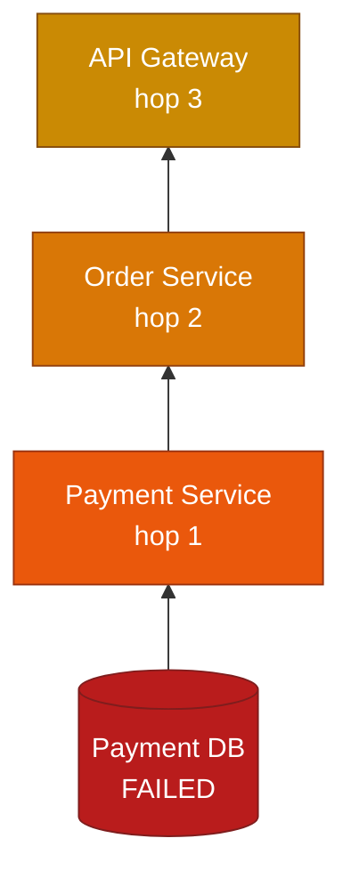

# InfraTrace — ER Diagram

Written in Mermaid so the diagram is version-controlled and diffable.
It renders directly in GitHub, in VS Code (Markdown preview, with the
*Markdown Preview Mermaid Support* extension), and at <https://mermaid.live>.

---

## 1. Full Entity-Relationship Diagram



---

## 2. The Self-Referencing Dependency Relationship

`DEPENDENCY` appears twice in the diagram above because it resolves a
**many-to-many relationship from `COMPONENT` back to `COMPONENT`**. Both of its
foreign keys point at the same table:



### Reading direction — the single most important convention

Getting this backwards inverts every answer the project gives, so it is worth
being explicit.

| Column | Role | In the example below |
|---|---|---|
| `component_id` | the **dependent** — the component that needs something | Order Service |
| `depends_on_id` | the **dependency** — the component being relied upon | Payment Service |

One row:

| `component_id` | `depends_on_id` | Read as |
|---|---|---|
| Order Service | Payment Service | "Order Service **depends on** Payment Service" |

Written as an arrow, `Order Service → Payment Service` means *Order Service
depends on Payment Service*. The arrow points at what is needed, not at what is
affected.

### Two directions of traversal

The same rows answer two opposite questions, depending on which column you
filter and which you follow.

| Question | Filter on | Follow to | Direction |
|---|---|---|---|
| "What does X **need**?" | `component_id = X` | `depends_on_id` | forwards, *down* the stack |
| "What **breaks** if X fails?" | `depends_on_id = X` | `component_id` | **reverse**, *up* the stack |

**Blast-radius analysis is the reverse traversal**, applied repeatedly. Start at
the failed component, find every row whose `depends_on_id` is in the set so far,
add those `component_id`s, and repeat until nothing new appears:

```
                   reverse traversal (blast radius)
                   ───────────────────────────────►
   Payment DB        Payment Service      Order Service      API Gateway
        ◄─────────────────── forward traversal (what X needs) ──────────

   row 1:  component_id = Payment Service,  depends_on_id = Payment DB
   row 2:  component_id = Order Service,    depends_on_id = Payment Service
   row 3:  component_id = API Gateway,      depends_on_id = Order Service
```

Reading those three rows left to right by `depends_on_id` gives the forward
chain; reading them right to left by `component_id` gives the blast radius. No
extra table and no duplicated data — the same 29 rows serve both.

This is why the recursive CTE in
[`07_blast_radius.sql`](../../database/queries/07_blast_radius.sql) joins
`d.depends_on_id = impact.component_id` rather than the other way round.

---

## 3. The ShopSphere Dependency Graph (sample data)

The 29 dependency rows in `seed.sql` form this graph. Arrows point from a
component to what it **depends on**.



Solid arrows are synchronous or data dependencies; dotted arrows are
asynchronous (event-bus) dependencies.

---

## 4. Blast Radius Example — "If Payment DB fails"

The recursive query in
[`database/queries/07_blast_radius.sql`](../../database/queries/07_blast_radius.sql)
walks the graph **upwards** — following `depends_on_id` back to `component_id` —
and produces this chain:



Continuing past the components to `application_component` shows the customer
impact: **ShopSphere Web**, **ShopSphere Mobile**, **ShopSphere Admin** and
**ShopSphere Partner API** all use at least one affected component.
